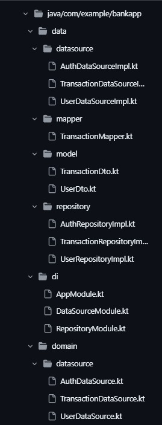
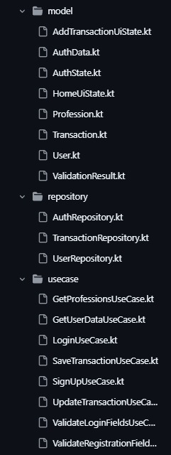
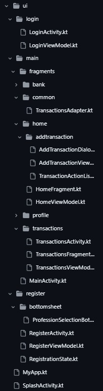
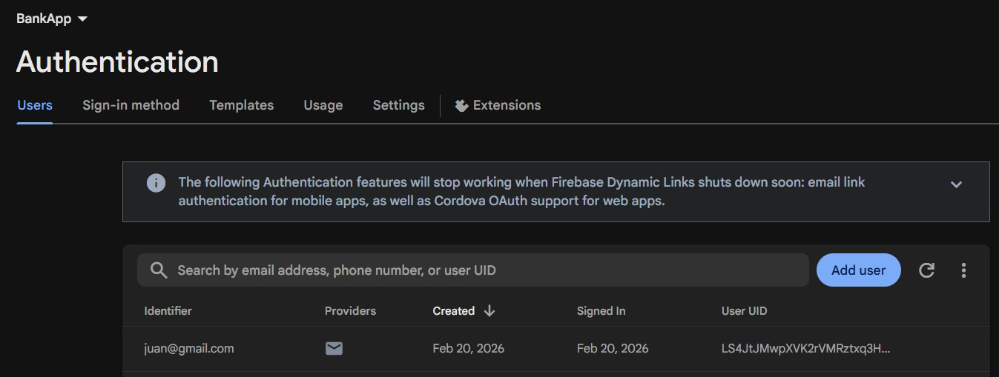
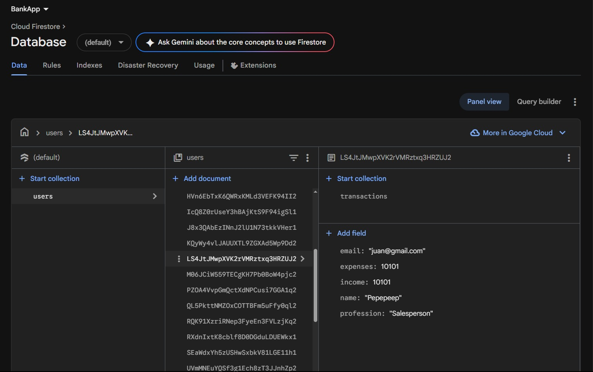
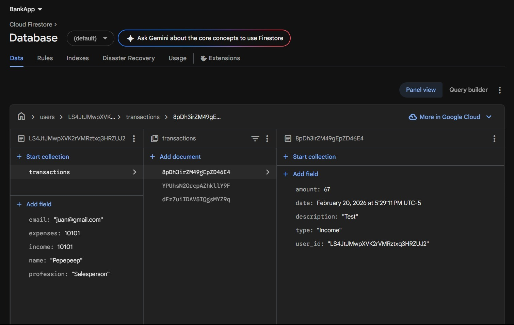
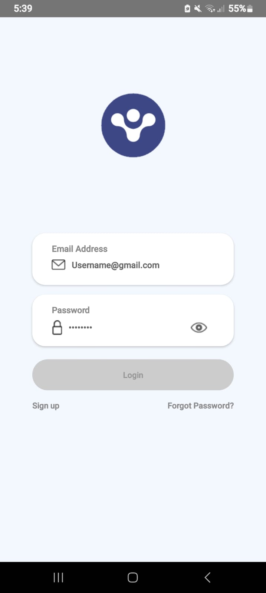
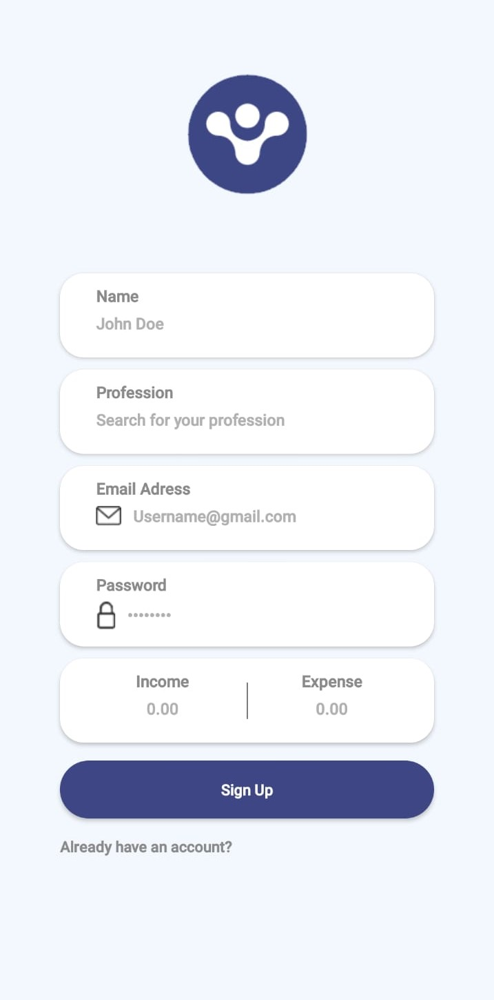
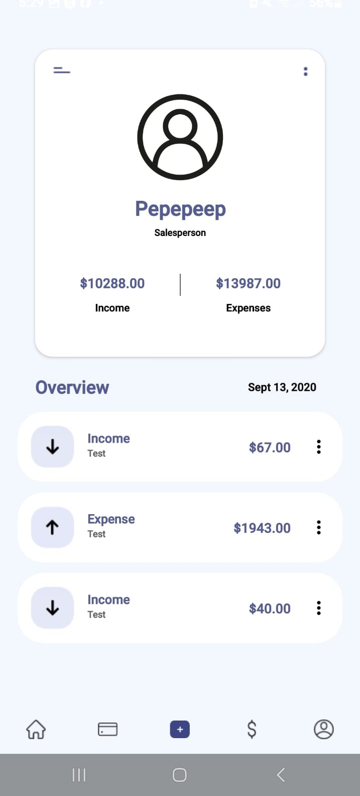

# TRANSACTION MANAGER - ANDROID SHOWCASE

Armé este prototipo para mostrar cómo conectar una app de transacciones de punta a punta.  
El flujo empieza con un sistema de **Login y Sign Up** conectado a **Firebase Auth**, y una vez dentro, todo el manejo de la plata se sincroniza en tiempo real con **Firestore**.

Está todo estructurado con **Clean Architecture**, usando el **ViewModel** como puente para que los flujos de datos sean reactivos y metiendo **Dagger Hilt** para que la inyección de dependencias gestione las instancias.  
La navegación principal se maneja con **Bottom Navigation**, haciendo que el flujo entre pantallas sea claro y fluido.

---

# 🚀 FUNCIONALIDADES PRINCIPALES

## 🔐 Autenticación y Registro

El usuario puede:

- Registrarse con:
  - Nombre
  - Email
  - Contraseña
  - Ingresos iniciales
  - Gastos iniciales
  - Profesión (seleccionada desde BottomSheet)
- Iniciar sesión.
- Mantener sesión activa.

Las validaciones están encapsuladas en la capa **Domain** mediante el  
`ValidateRegistrationFieldsUseCase`.

Se validan reglas como:

- Nombre mínimo 3 caracteres.
- Email con formato válido (Regex).
- Contraseña con:
  - mínimo 6 caracteres
  - al menos 1 mayúscula
  - al menos 1 número
- Ingresos y gastos mayores o iguales a 0.
- Profesión obligatoria.

Cada campo retorna un `ValidationResult` (Valid / Invalid con mensaje específico), permitiendo mostrar errores por campo sin mezclar lógica con la UI.

---

## ➕ Gestión de Transacciones

Desde el botón central (+) el usuario puede:

- Crear transacciones ilimitadas.
- Elegir tipo:
  - Income
  - Expense
- Ingresar monto y descripción.
- Editar transacciones existentes.
- Ver estados de:
  - Loading
  - Success
  - Error

La lógica está separada en:

- `SaveTransactionUseCase`
- `UpdateTransactionUseCase`

El ViewModel solo orquesta estados (`StateFlow`), sin acceder directamente a Firebase.

---

## 📊 Visualización y Filtros

- Home muestra transacciones recientes.
- Historial muestra listado completo.
- Filtros por:
  - All
  - Income
  - Expense

Las listas usan `ListAdapter` + `DiffUtil` para actualizar eficientemente.

Los datos se exponen mediante Flows conectados a Firestore en tiempo real.

---

# 🏛️ ARQUITECTURA: DATA, DOMAIN, UI Y DI

El proyecto está separado en capas independientes para mantener la lógica de negocio aislada de la infraestructura.

| | | |
| :---: | :---: | :---: |
|  |  |  |

* **Domain Layer:** Uso de UseCases para validaciones, guardado, edición y filtrado.
* **Data Layer:** Repositorios que implementan interfaces del dominio y se comunican con DataSources (Firebase y Ktor).
* **UI Layer:** Fragments + ViewModels observando estados reactivos.
* **Mappers:** Transformación de DTOs a modelos de dominio para evitar acoplamiento.

---

# ⚙️ MANEJO DE DATOS Y NETWORKING

La app gestiona la información de forma reactiva y desde distintas fuentes:

* **Real-time Data:** Uso de `callbackFlow` en DataSources para convertir listeners de Firebase en Flows.
* **Networking (Ktor):** Consumo de APIs externas en formato JSON de manera asíncrona.
* **Optimización de listas:** `ListAdapter` + `DiffUtil` para gestionar cambios eficientemente.

---

# 📊 PERSISTENCIA Y AUTH (FIREBASE)

### 🔐 Authentication
| |
| :---: |
|  |

### 📊 Cloud Firestore
| | |
| :---: | :---: |
|  |  |

---

# 📱 VISTA PREVIA DE LA APP

| LOGIN | REGISTRO | HOME |
| :---: | :---: | :---: |
|  |  |  |

| RECIENTES | HISTORIAL |
| :---: | :---: |
|  |  |

---

# 🛠️ TECH STACK

* Kotlin (Coroutines & Flow / StateFlow)
* Clean Architecture + MVVM
* Dagger Hilt
* Firebase (Auth & Firestore)
* Ktor Client
* Jetpack Navigation
* ViewBinding & Coil

---

> **Nota técnica:** El manejo de estados de UI se implementa con `Sealed Classes` y se observa usando `repeatOnLifecycle`, asegurando recolección segura de Flows y evitando fugas de memoria.

> Proyecto desarrollado como práctica enfocada principalmente en arquitectura, separación de responsabilidades y manejo de estados reactivos.
